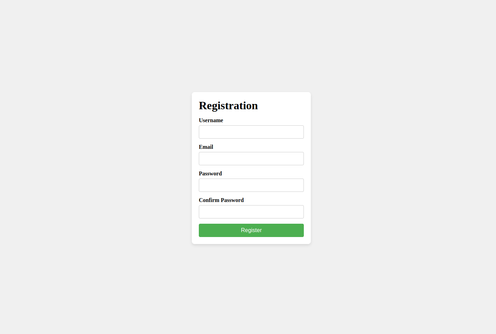

#### Result

#### HTML

1. Создайте `
` с классом `registration-container`:
2. Внутри `
` с классом `registration-container`, создайте элемент `<form>` с классом `registration-form`:
3. Внутри `<form>` с классом `registration-form` создайте заголовок с текстом `Registration`
4. Внутри `<form>` с классом `registration-form`, создайте несколько элементов `
` с классом `form-group` для каждой группы элементов формы: `name`, `email`, `password`, `confirm-password`
5. Внутри каждого `
` с классом `form-group`, создайте элемент `<label>` и элемент `<input>` для каждого поля ввода:
6. Внутри `<form>` с классом `registration-form` добавьте кнопку с классом `register-button` для отправки формы:

#### CSS

1.  Добавьте стили для контейнера регистрации `(registration-container)`:

    1. Отображение: flex
    2. Выравнивание по горизонтали: center
    3. Выравнивание по вертикали: center
    4. Высота: 100vh
    5. Цвет фона: #f0f0f0
    6. Отступы: 0
    7. Направление flex: column
    8. Промежуток между элементами: 20px

2.  Добавьте стили для формы регистрации `(registration-form)`:

    1. Отображение: `flex`
    2. Направление flex: `column`
    3. Промежуток между элементами: `15px`
    4. Цвет фона: `white`
    5. Внутренние отступы: `20px`
    6. Радиус границы: `8px`
    7. Тень блока:` 0 4px 8px rgba(0, 0, 0, 0.1)`
    8. Ширина: `300px`

3.  Добавьте стили для группы элементов формы `(form-group)`:

    1. Отображение: `flex`
    2. Направление flex: `column`
    3. Промежуток между элементами: `5px`

4.  Добавьте стили для меток `(label)`:

    1. Толщина шрифта: `bold`

5.  Добавьте стили для полей ввода `(input)`:

    1. Внутренние отступы: `10px`
    2. Граница: `1px solid #ccc`
    3. Радиус границы: `4px`
    4. Размер шрифта: `14px`

6.  Добавьте стили для кнопки регистрации `(register-button)`:

    1. Внутренние отступы: `10px 20px`
    2. Цвет фона: `#4CAF50`
    3. Цвет текста: `white`
    4. Граница: `none`
    5. Радиус границы: `4px`
    6. Курсор: `pointer`
    7. Размер шрифта: `16px`
    8. Переход цвета фона: `0.3s`

    Для состояния `hover`:

    1. Цвет фона при наведении: #45a049
