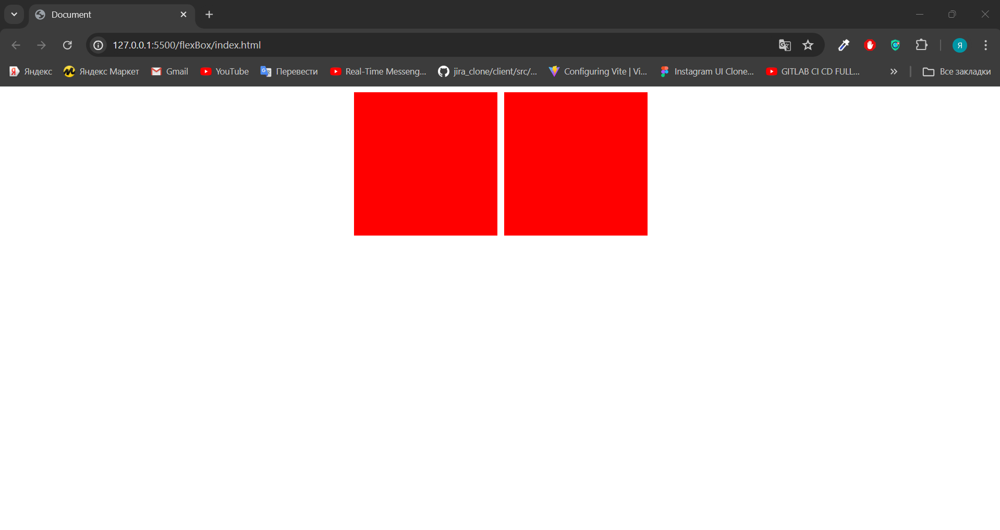

### 1. Создай такой Html, задайте селекторы, и стили

```
    <div>
      <div></div>
      <div></div>
    </div>
```

### Результат должен быть таким:


### 2. Создай такой Html, задайте селекторы, и стили

```
    <div>
      <div></div>
      <div></div>
    </div>
```

### Результат должен быть таким:


### 3. Создай такой Html, задайте селекторы, и стили

```
    <div>
      <div></div>
      <div></div>
    </div>
```

### Результат должен быть таким:


